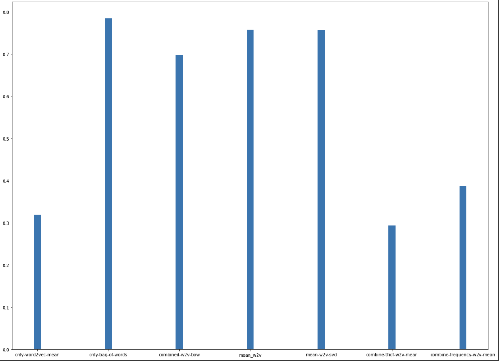

# Reddit Comment Classification
This project was developed as the final project for the Introduction to Machine Learning course at Ferdowsi University of Mashhad. The main objective of this project was to classify Reddit comments from scientific channels into three distinct categories. This task involved various stages, including data preprocessing, text cleaning, and the application of different machine learning techniques for text classification.

## Project Overview
The project can be broken down into the following main steps:

### Data Preprocessing:

Data preprocessing is a crucial step in any text classification task. In this project, we utilized various techniques to prepare the Reddit comments for analysis. These techniques included:
Removing special symbols and URLs to ensure that the text data is clean and relevant.
Tokenization to break the text into individual words or tokens.
Additional techniques to clean and structure the data for better analysis.
### Text Classification:

To classify Reddit comments accurately, we explored multiple text embeddings and representations, including:
- Word2Vec: A word embedding technique that represents words as vectors in a continuous space.
- Bag-of-Words (BoW): A simple and effective way to represent text data by counting the frequency of words in each document.
- Bag-of-Vectors: Similar to BoW, but representing words as vectors.
- TF-IDF (Term Frequency-Inverse Document Frequency): A numerical statistic that reflects the importance of a word in a document relative to a collection of documents.
- Additionally, we applied various classification algorithms to the text data. These algorithms are essential for training the model to predict the category of each Reddit comment.
### Clustering Integration:

As an experimental approach, we integrated a clustering algorithm to see if it could enhance the classification model's performance. The idea was to add cluster labels as input features to the classification model to improve accuracy.

## Results
After extensive experimentation, we found that the best model achieved an accuracy of 78 percent. This model was built using the Bag-of-Words (BoW) embedding technique in combination with a linear Support Vector Machine (SVM) classifier. This result highlights the effectiveness of using a straightforward text representation method like BoW in combination with a powerful classification algorithm like SVM.

